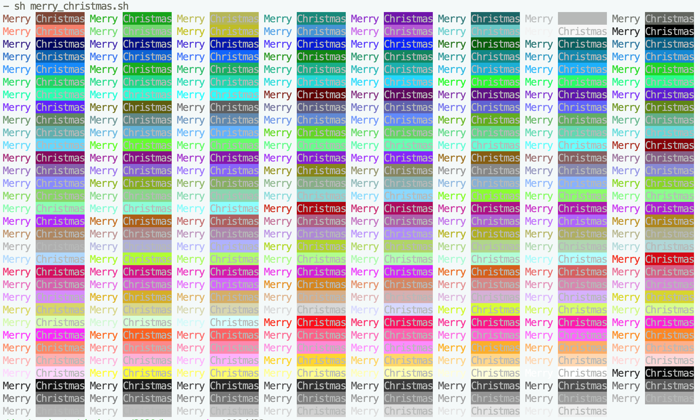

To Henry,

Merry Christmas!

Wow, what a year it's been. I hope you're doing okay. I thought I would make
you something this year in the same spirit you'll be making all of us
something.

I know you wanted to get into programming so I thought I would write up a few
bits of information on where to start and some of the most useful resources
I've used. I think you mentioned you wanted to learn a bit of Node.js and that
you had a Raspberry pi so I've written this guide with that in mind.

# The basics

I'll start with the very basics that will be useful to you whatever you're
wanting to program.

## terminals + shells

Terminals are a fascinating bit of legacy software that have survived for, well
legacy reasons. In the past, personal computers used to boot into a full-screen
terminal, and for that reason personal computers were actually referred to _as_
terminals. Nowadays terminals are programs that run essentially the same
software but render the final output to a GUI, which is typically a window-based
system.

On macOS for example, you'll find Terminal.app that implements a terminal
wrapped in a Cocoa GUI.

A terminal (not shell) is a program that is responsible for outputting text to a
screen. Most of the time you will not have to care about what terminals are or
what they do. This is generally because the only program you will ever run
inside a terminal is a _shell_.

A shell is a program that provides an interactive interface for running
commands. There are a few different shells out there but the most commonly used
is `bash`.

### `bash`

When you open e.g. Terminal.app on macOS, it will automatically start `bash` in
every tab you open. `bash` allows you to run commands, which will come in handy
when you're testing code, running programs, deploying code, basically anything
related to software development. Most guides out there will start with the
assumption that you can run commands in a shell so I can recommend getting
comfortable with it.

On Windows, you can run `bash` if you've installed
[WSL](https://docs.microsoft.com/en-us/windows/wsl/) (I think).

Apart from running commands, `bash` is useful for executing multiple commands in
a sequence from a file called a script. It has loops, variables, conditionals,
functions and can call any command.

Here's a script I wrote:

```bash
# merry_christmas.sh

# Loop over all foreground/background colours, print
for i in {1..255}; do
  printf "\e[38;5;$i""m Merry\e[m \e[48;5;$i""m\e[37mChristmas\e[m"
  if [[ $((i%=8)) -eq 0 ]];
    then printf "\n";
  fi
done
```

Try pasting the above into a file and running it:
```bash
 $ bash merry_christmas.sh
```

The output you should have seen should look a bit like this:



If you want to get more acquainted with `bash`, I can suggest many years of just
using it. I will be honest I still occasionally use the [bash cheat sheet](https://devhints.io/bash)
when I'm writing a new script.

There's also a nice-looking introduction I found by Microsoft that might be
useful to you:
  https://docs.microsoft.com/en-us/learn/modules/bash-introduction/

I haven't gone into the details about how terminals and shells interact because
you generally don't need to know. There's a section on it at the end if you
really want to know wtf is going on there.

## editors


## git

Git allows programmers to track changes to the files they're working on. These
files could be source code files, images, READMEs (like this) or literally any
kind of file. Git generally works better with files that are text-based because
it's optimised to track changes in large code bases with millions of lines of
code.

Fun fact, it was originally built to track changes to the source code of linux
so you know it's legit.

To learn about git, I can highly recommend the Pro Git book, which has some
great introductory sections on how git works. It's not essential to know how it
works but it does help a hell of a lot when you're trying to use it. Having a
decent mental model of git should save you a lot of time in the long run, even
for smaller projects. The first three chapters will be enough to do most of what
you will want from Git.
  -> [https://git-scm.com/book/en/v2](https://git-scm.com/book/en/v2)

Something you might want to try out is cloning this repository and running
and/or messing with the scripts I've put here, e.g.
[merry_christmas.sh](./merry_christmas.sh):

```bash
 $ git clone https://github.com/lukebarnard1/christmas
 $ cd christmas
 $ sh merry_christmas.sh
```

## cheat sheets

Once you've got the basics down, cheat sheets are great for quick reference.

 - `bash`: https://devhints.io/bash
 - `git`: https://about.gitlab.com/images/press/git-cheat-sheet.pdf


## advanced stuff

### what do terminals actually do?

Terminals today are programs that interpret the output of other programs in
order to render a text-based interface to a screen.

To illustrate how exactly this works, I'll use the example of the text "man
bash" being entered into the terminal, followed by the <kbd>enter</kbd> key.

Let's start with pressing the "m" key:
  1. The key m is pressed
  2. The keyboard driver software handles a signal the indicates that the "m"
     key has been pressed
  3. The terminal GUI program runs some code that handles this signal, passing
     the character "m" as data to the program currently running, which in this
     case is `bash`.
  4. `bash` receives this data and does the following:
     a. prints the character "m" at the current cursor position (output: "m")
     b. moves the cursor position one place to the right (output: "\e[C")
  5. The terminal receives the character "m" and the control sequence, updating
     the visible buffer accordingly after each one.

The important steps are 4 & 5. In step 4, the terminal sends data to `bash` and
`bash` responds by sending some output immediately. The output in 4.a indicates
to the terminal that the character "m" should be printed at the current cursor
location. The output in 4.b indicates to the terminal that the cursor position
should move one position to the right. The terminal distinguishes the sequence
from text output thanks to the "\e\[" sequence. This sequence of bytes (which is
often denoted "ESC \[" and can be output with the `printf` command with the
string "\e\[" or "\033\[") is known as the _Control Sequence Introducer_. This
sequence indicates to the terminal that the next few characters are likely part
of a _Control Sequence_.

The cool thing is that you can output these sequences from your own programs
(well I think it's cool anyway). So if you ever want your program to run in a
terminal and have blinking green text, you can do that! For details on every
single code that was ever probably implemented, see
[this mad bit of documentation from the fringes of the web](https://invisible-island.net/xterm/ctlseqs/ctlseqs.html)

### help! my shell prompt is boring 😱

By far the most common use of control sequences for programmers just starting
out is customising the "prompt" in your shell, which is the text that is printed
before you enter a command. There are even [tools on the web](http://bashrcgenerator.com/)
to simplify the process of picking your favourite colours 😍.

For example, you might want to go for a bright pink with white text and a star
emoji:

```
 $ export PS1='\e[48;5;200m\e[38;5;255m\w ⭐️ $ '
```

, which just FYI looks bad-_ass_:


Looking at that command above, you'll notice the word `export` - this is for
setting environment variables.


